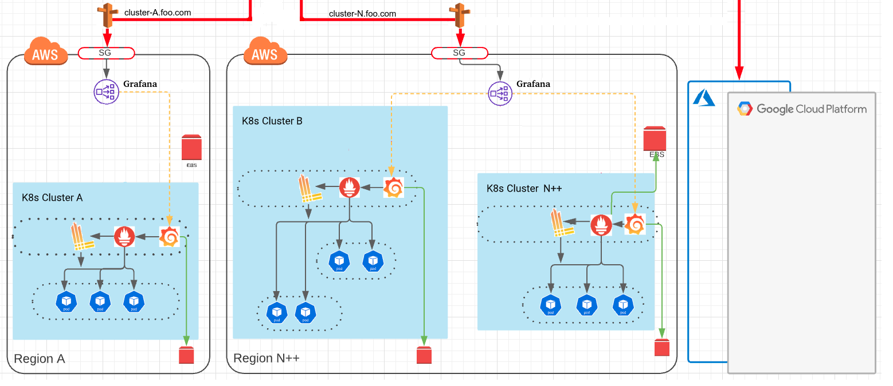
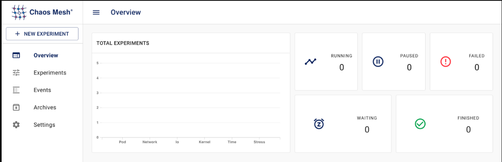

<h1><b>MOSt</h1> Monitoring Observability Stack </b> 
  

    

  
I have been desinging this stack (and all deploy in it) to use like "Plug and play Monitoring"  and trying not to depend of a single cloud provider  (the famous "vendor lock in").   This is the "key of my focus" and the greatest effort that I did.
 
This stack contains everything necessary for a correct visualization and troubleshooting of the infrastructure and analysis of the behavior of your platform.  

To use it,  you only need to deploy it in your kubernetes cluster, wait a few minutes to all service started (Running state)  and after that you will see all data in your Grafana.  
Yes its a super "Easy to implement"!!!!  

In grafana you will see: 
 - All Kubernetes Metrics (of all resources)
 - All logs of your pods and another logs like AutoScaller  (requiere that your pods send  logs to STDOUT)
 - Metrics and data from Cloudwatch. ( Relax, this metrics will not save in prometheus, this metrics only will be consumed from Cloudwatch).
 

 
In my daily work, I use this stack to troubleshoot all infra issues.
I use Polaris to mantain my deploys using the best practices in kubernetes.  
And finally use chaos-mesh to do some chaos experiments (crashes controlled by myself) and try to analize new scopes or in the best case can "predict" (more or less) what could be do if something happen  (like my experiment)
 
<b>It was created based on my own experience working with kubernetes and how to do a simple troubleshoot or analysis of the most common problems using this dashboards </b>

  

<h1><b> Stack </b></h1>

| Name   |  Info  | 
| ---   |  ---  | 
|<b>Kubernetes | </b> Where you will deploy this super cool stack  | 
|<b>Prometheus | </b> The service in charge of consuming and storing metrics of the infrastructure and the resources of the components (pods, nodes, volumes, etc)  | 
|<b>Loki | </b> The service in charge of consuming and storing the logs exposed by the components  | 
|<b>Cloudwatch | </b> The service through which specific metrics of each component of aws can be obtained  | 
|<b>Grafana | </b> The one in charge of visualizing the data stored in the aforementioned services. All dashboards are stored in the repository as code.   | 
|<b>Polaris | </b> Polaris keeps your clusters sailing smoothly. It runs a variety of checks to ensure that Kubernetes pods and controllers are configured using best practices, helping you avoid problems in the future.  | 
|<b>Chaos-Mesh | </b> A Powerful Chaos Engineering Platform for Kubernetes  | 

  

<h1><b> Steps to deploy it </b></h1>

| Command                                   | Required | Obs |
| ---                                       | ---      | --- |
| kubectl apply -f 01-hpa_and_autoscaler/   | Optional | -   | 
| kubectl apply -f 02-troublePOD/           | Optional | Only if you use a pod to investigate something, is not the best way but works |
| kubectl apply -f 03-ingress/              | Yes      |  -  |
| kubectl create -f 04-setup-monitoring/    | Yes      | Go for a coffee, its take a few time   |
| kubectl create -f 05-monitoring/          | Yes      | Go for another coffee.  Its take a few time. (here is where the magic happen).|
| kubectl apply -f 06-Loki_log_monitoring/  | Yes      |  -  |
| kubectl apply -f 08-polaris/              | Optional | Useful to maintain your deployed with kubernetes best practices |
| kubectl apply -f 09-kubernetes-dashboard/ | Optional | I dont like use UI, I prefer the CLI, but I need to admit that it's really is useful  |

  

<h1><b> Important files: </b></h1>

|File name                          |Info           |Obs            |
|---                                |---            |---            |
|grafana-dashboardDatasources.yaml  |Configure al datasources like, prometheus, loki, cloudwatch, etc| - |
|grafana-service.yaml               |Configure AWS Load Balancer to acces to grafana. | - |
|grafana-deployment.yaml            |Configure Grafana credetials, plugins and add your dashboard path using volume files. | - |
|grafana-dashboardSources.yaml      |Configure grafana dashboards path, folders, providers, etc. | - |
|grafana-dashboardDefinitions.yaml  |Bassic comunity dasbhards | - |
|grafana-dashboard-(sub-name).yaml  |Dashboards that I have been creating and getting from our lovely community | - | 
|06-Loki_log_monitoring             |Configure your own deploy and modify storage size (EBS) | - |

  

 
  <h1><b> Architecture </b></h1>
   
  
     
  <h1><b> Important Dashboards </b></h1>
    
 
          Detailed information about Pod status, volume status, volume attached, last logs and more
   
 
               Detailed information on resources used by each pod (similar to kubectl top pod) 
    
 
                Logs for each pod (similar to:  kubectl -n NAMESPACE logs POD ) 
    
 
           VPN and tunnel status information 
    
 
         Remember, to manage cloudwatch you need a user with ReadOnly permissions
      

   

<h1><b>What information have each dashboard? </b></h1>

 

### Default / Logs by App  (one of my favourites)
<pre>
 - Application logs (similar to kubectl logs pod )
 - Possibility to filter up to 3 levels in real time
</pre>
 

### Default / Nodes
<pre>
- Real-time information on CPU usage of the node
- Node load average information
- Node memory information
- Disk information (I/O) of the node
- Node disk space information
- Network Information (In/Out)
</pre>
 

### Default / Kubernetes simple and fast Troubleshooting (I spent a lot of time on this, super useful)
<pre>
- Total nodes    
- Total Pods     
- Pods in a state other than running
- Status of the pods (type kubectl get pod )
- Number of restarts that each pod has
- The ip of the node in which that pod is hosted
- Volume status and total space, used
- eks version of the kubernetes node (kubelet + kubeproxy)
- version of docker that runs the node
- The last 100 logs if there is a failed pod (if there are no failed pods it is not shown)
- Detailed status of the volumes (name, type, and capacity of the same)
- Repository and Container Image used in the pod.
- Reasons of last fail pod/container
</pre>
 

### Default / AWS VPN
<pre>
- IN/OUT traffic of each tunnel
- State of the VPN tunnels discriminated by account
</pre>
 

### Default / AWS RDS
<pre>
- CPU information from the database
- Disk Queue Deph Information
- ReadLatency
- Read Thought
- Network IN/OUT
</pre>
 

### Default / kubernetes-pvc-fast-view
<pre>
- Detailed status of the volumes (name, type, and capacity of the same)
- PVCs size status
- PVCs Above Warning Threshold
- PVCs in Pending State
- PVCs in Lost State
- Disk usage trend
- Disk usage rate
</pre>

 

### Default / AWS Certificate Manage
<pre>
- Information on when the certificates expire
</pre>
 

### Default / AWS Auto Scaling
<pre>
- Cluster autoscaling information
</pre>
 

### Autoscaler kubernetes
<pre>
- Detailed information on what happens to the cluster when it scales up or down
</pre>
 

### Default / Kubernetes / Compute Resources / Pod
<pre>
- Information on cpu usage of each pod
- Information on throttling (https://www.geeknetic.es/Throttling/que-es-y-para-que-sirve)
- Information on assigned resources (request/Limits) of each pod
- Memory usage information for each pod
- Network information (In/Out) of each pod
- Storage IO information of each pod
</pre>
 

### Default / AWS ELB Application Load Balancer (ALB) & AWS Network Load Balancer (NLB)
<pre>
- Information of AWS load balancers discriminated by account
- HTTPCode_Target information (2xx, 3xx, 4xx, 5xx)
- HTTPCode information (2xx, 3xx, 4xx, 5xx) 
</pre>
  

<h1><b>Other super cool tools </b></h1>

 
 <h2>Polaris</h2> 
Polaris keeps your clusters sailing smoothly. It runs a variety of checks to ensure that Kubernetes pods and controllers are configured using best practices, helping you avoid problems in the future.
 
 

   

 <h2>Chaos-Mesh</h2> 
A Powerful Chaos Engineering Platform for Kubernetes
 

 

<h1><b>Access</b></h1>

 

### Grafana:
 - Option A) kubectl -n monitoring get svc|grep grafana-external-service
 - Option B) Create a Route53 alias and attach it to load balancer
 - admin : SuperPowerPassword  (change it in grafana-deployment.yaml #L35 )

  
  

<h1><b> Roadmap </b></h1>

| Feature                   | Status                                | 
| ---                                                     | ---     | 
| Open it to all community                                | Done    |  
| Generate dashboards for simple and fast troubleshoot    | Done    | 
| Generate dashboards for aws resources                   | Done    |
| Generate documentation                                  | Done    |
| Configure Prometheus Federation                         | Ongoing |
| Configure AlertManager                                  | Pending | 
| Document how to Encrypt all data in rest                | Pending | 
| Add videos how to troubleshoot using this stack         | Pending |
  

